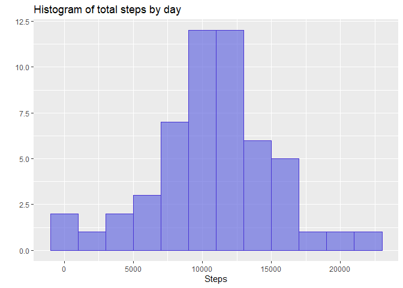
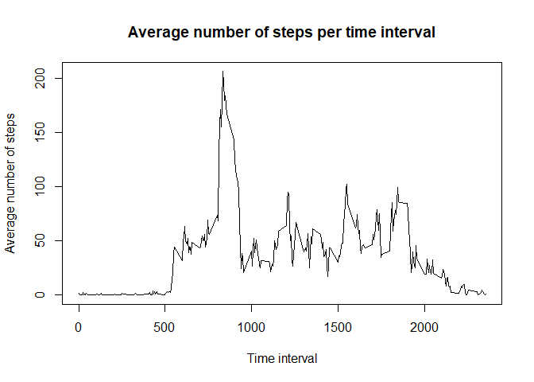
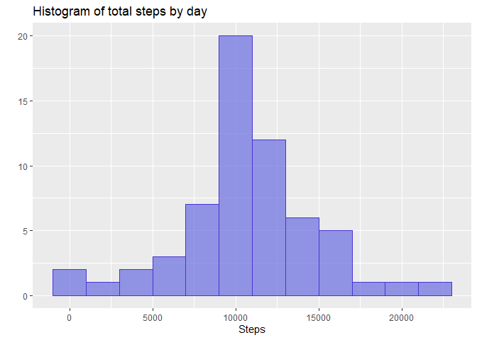
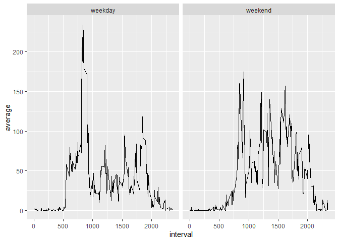

## Loading and preprocessing the data

First we load the data into a variable using read.csv


```r
activity <- read.csv("activity.csv")
```

It is always good to check a few rows of the data using head()


```r
head(activity)
```

```
##   steps       date interval
## 1    NA 2012-10-01        0
## 2    NA 2012-10-01        5
## 3    NA 2012-10-01       10
## 4    NA 2012-10-01       15
## 5    NA 2012-10-01       20
## 6    NA 2012-10-01       25
```

## What is mean total number of steps taken per day?

Let's plot a histogram of the number of steps taken by day using ggplot2.

First we need to calculate the total number of steps for each day. For this, we use tapply.


```r
steps_day <- with(activity, tapply(steps,date,sum))
```

We can then display the histrogram using qplot


```r
library(ggplot2)
qplot(steps_day, 
      geom = "histogram", 
      binwidth=2000, fill=I("#686de0"), 
      alpha=I(0.7), 
      col=I("#4834d4"), 
      xlab = "Steps", 
      main="Histogram of total steps by day")
```

```
## Warning: Removed 8 rows containing non-finite values (stat_bin).
```

<!-- -->

Finally, let's calculate the mean and median


```r
mean <- as.integer(mean(steps_day, na.rm = TRUE))
median <- median(steps_day, na.rm = TRUE)
```

The mean is **10766** and the median **10765** 

## What is the average daily activity pattern?

We need to split the data by interval and calculate the average number of steps for each interval


```r
avgIntervals <- with(activity, tapply(steps, interval, mean, na.rm = TRUE))
```

Lets plot this using the base graphics plot


```r
plot(x = names(avgIntervals), y = avgIntervals, type="l", xlab = "Time interval", ylab = "Average number of steps")
title(main= "Average number of steps per time interval")
```

<!-- -->

We now need to find out at which interval contains the maximum number of steps (around 200 according to the plot)


```r
max <- as.integer(names(which.max(avgIntervals)))
```

The maximum steps number occurs at interval **835**

## Imputing missing values

NA values can be problematic in data analysis :(

How many NA values do we have in our data ? Let's find out using is.na()


```r
na_count <- sum(is.na(activity$steps))
```

It seems we have a total of **2304** NA values !

Let's replace all NA values with the average of steps accross all days for that interval and store this in a new dataset.


```r
activity_noNA <- activity
for(i in seq_along(activity_noNA$steps)) {
  if (is.na(activity_noNA$steps[i])) {
    interval <- activity_noNA$interval[i]
    intervalMean <- mean(activity_noNA$steps[activity_noNA$interval == interval], na.rm = TRUE)
    activity_noNA$steps[i] <- intervalMean
  }
}
```

We can check if this had any effect on previous results


```r
steps_day_noNA <- with(activity_noNA, tapply(steps,date,sum))

qplot(steps_day_noNA, 
      geom = "histogram", 
      binwidth=2000, fill=I("#686de0"), 
      alpha=I(0.7), 
      col=I("#4834d4"), 
      xlab = "Steps", 
      main="Histogram of total steps by day")
```

<!-- -->

```r
mean_noNA <- as.integer(mean(steps_day_noNA))
median_noNA <- as.integer(median(steps_day_noNA))
```

The new mean is **10766** and the new median is **10766**


## Are there differences in activity patterns between weekdays and weekends?

We start by writing a short function to output "weekday" or "weekend" depending on date


```r
daytype <- function(date) {
  if (weekdays(as.Date(date)) %in% c("Saturday", "Sunday")) {
    "weekend"
  } else {
    "weekday"
  }
}
```

We then apply this function to the data to generate a new column called daytype 


```r
library(dplyr)
activity <- activity %>% mutate(daytype = sapply(date, daytype))
activity$daytype <- as.factor(activity$daytype) 
```

We can now check how the average number of steps per interval differs between weekends and weekdays 


```r
avgIntervals <- activity %>% group_by(interval, daytype) %>% mutate(average = mean(steps, na.rm = TRUE))
plot <- ggplot(avgIntervals, aes(x = interval, y = average))
plot + facet_grid(.~daytype) + geom_line() + labs(main = "Average steps by interval for weekdays and weekends")
```

<!-- -->
